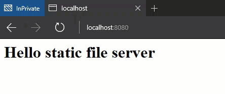

# Static FileServer using Express
Scenario: lightweight webserver for static files and handling of specific routes.  

The sample shows how to handle invalid routes. Instead of returning a 404 the index.html page is returned. This can be helpful e.g. while developing Angular apps where routes will be handled by Angular index.html/router.

